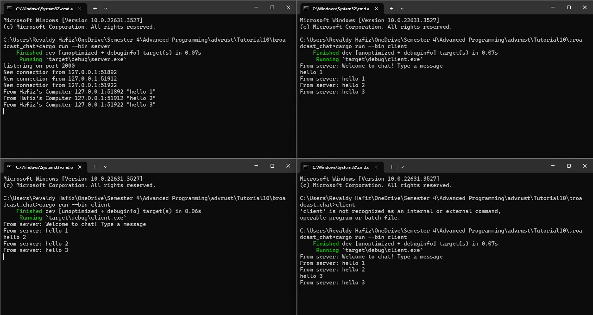
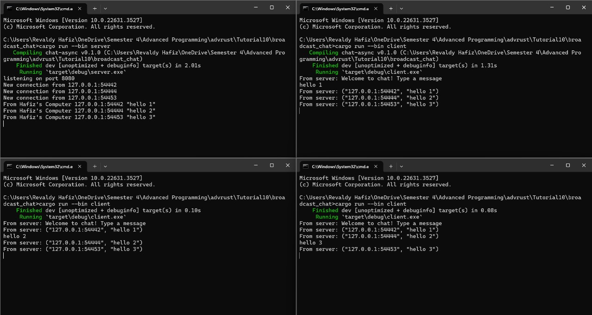

# Tutorial 10

## BroadcastChat

### Experiment 2.1: Original code, and how it run


to run both server and client:

```
cargo run --bin server
```

```
cargo run --bin client
```

After running both server and clients, and sending messages from each client, i noticed that the server will send back message to all current connected clients.

### Experiment 2.2: Modifying port

To modify the port to 8080 and ensure proper functionality, we need to update both the server and client code. Since they communicate over WebSocket protocol, both sides must use the same port.

Here's the approach to modify the port:

1. Server Side (`server.rs`):
    In the `main` function of `server.rs`, update the port to 8080 where the server listens for incoming connections using `TcpListener::bind("127.0.0.1:8080").await?;`.

2. Client Side (`client.rs`):
    In the main function of `client.rs`, update the URI to connect to the server using port 8080, `Uri::from_static("ws://127.0.0.1:8080")`.

Since both the server and client use WebSocket protocol, it's crucial to ensure they use the same port for proper communication.

The WebSocket protocol is specified and made available through the tokio_websockets crate. This crate provides essential features like ClientBuilder, used to establish connections from the client side, and Message, employed for exchanging messages between the server and client. These functionalities are utilized in both the server and client implementations.

### Experiment 2.3: Small changes, add IP and Port



Modified the server to extract sender's IP and port from the connection's SocketAddr. Integrated this information into the welcome message upon client connection and broadcasted messages.